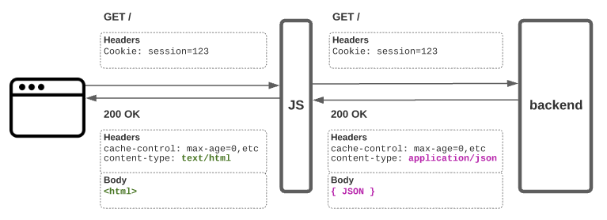

# coexist

A pattern for unobtrusively server-rendering JS views when using non-JS frameworks.

Render JSON to HTML in an edge worker or reverse proxy. Let your preferred backend handle literally everything else.

## Why?

Here are 2 things I think are true:

### There is value in non-JS web frameworks.

- Rails is well-documented, well-maintained, well-understood, stable and secure.
- WordPress' dashboard and editorial workflows are familiar, flexible and powerful. Gutenberg's block model and extensibility are great.
- *Insert praise for your non-JS framework of choice here.*

### There is value in the JS ecosystem's approach to UI development.

Code-based components and JSX over templates. Modules and a true front end dependency graph. Different CSS approaches. Different client bootstrapping approaches. Integration with design tools. Storybook. ESLint. Types.

All together, this stuff has enabled new and productive UI development processes that are still largely missing when building UI in non-JS frameworks.

## The pattern

Build a non-JS app like you normally would. Talk to your database. Make API calls. Run async background jobs. Gather and transform data. Respond to requests with pages.

Just don't bother rendering HTML. Instead, render JSON and transform it to HTML on the way through an edge worker or a Node.js reverse proxy.

Everything else about your original response — cookies, headers, HTTP status, redirects, caching — remains exactly as you sent it.

### Yeah, but...

  
<b>Isn't this just sticking a Node.js app in front of a Rails/WordPress/whatever API? That's not new.</b>

  Kind of.

  It's a short, but very consequential leap from server-rendered React to a JS app responsible for routing, auth, data fetching and transformation, async job processing, isomorphic everything, and more.

  In the real world, this model has tended to give JS far more responsibility than it needs, ditching a lot of the out-of-the-box value provided by non-JS frameworks.

  Coexist pushes as much as possible back to your preferred non-JS backend. JS is left with one job: transforming JSON into a web page.

  
<b>I can do everything non-JS frameworks do in JS alone.</b>

  Cool. You probably don't need this.

  
<b>I don't agree that UI development is better in the JS ecosystem.</b>

  Cool. I disagree. That's OK 🤗 open an issue and give me your thoughts.

  
<b>Wouldn't this result in a terrible security risk?</b>

  Whoops. Mea culpa. I haven't used this pattern in anger on anything yet. This repo is a quick exploration of a thought bubble. Please open an issue 🙂

  
<b>How is this different from react-rails or airbnb/hypernova</b>

  Those projects achieve React SSR in a Rails app by shoehorning a not-very-Railsy thing right into the middle of Rails' usual request/response lifecycle — hypernova makes a HTTP request; react-rails shells out to a Node.js process (as does its WordPress cousin [react-wp-ssr](https://github.com/humanmade/react-wp-ssr)).

  This means you now need prod Node.js infrastructure, and importantly your Rails app (and your ability to serve HTML or upgrade Rails) become tightly coupled to those libraries.

  (I love both of those projects so this isn't a diss. If you're comfortable with them, use them. The issue count and last activity dates on both aren't very confidence-inspiring though.)

  In contrast, the coexist approach doesn't require you to change anything fundamental like that in your backend framework. Just render JSON instead of HTML.

  
<b>This is weird. Rendering pages as JSON and HTML in an external JS service is a bridge too far.</b>

  Conceptually I think it's pretty close to client-only rendering — just with the rendering step nudged a few miles down the road from the browser to a CDN edge worker. But like every solution, this one comes with tradeoffs. Good on you for weighing them up, thanks for reading 🙂

## Live demos [TODO]

- Rails app
- Hapi reverse proxy example
- Cloudflare Workers example
- AWS Lambda@Edge example
- Storybook

## Installation

Woah there, this isn't a library or a framework. It's just a demo of this pattern using Rails with a Yarn Workspaces monorepo. It's a [template repo](https://docs.github.com/en/github/creating-cloning-and-archiving-repositories/creating-a-repository-from-a-template) though, so feel free to take it and run with it.

See [development.md](docs/development.md) for setup, local development and deployment instructions.
